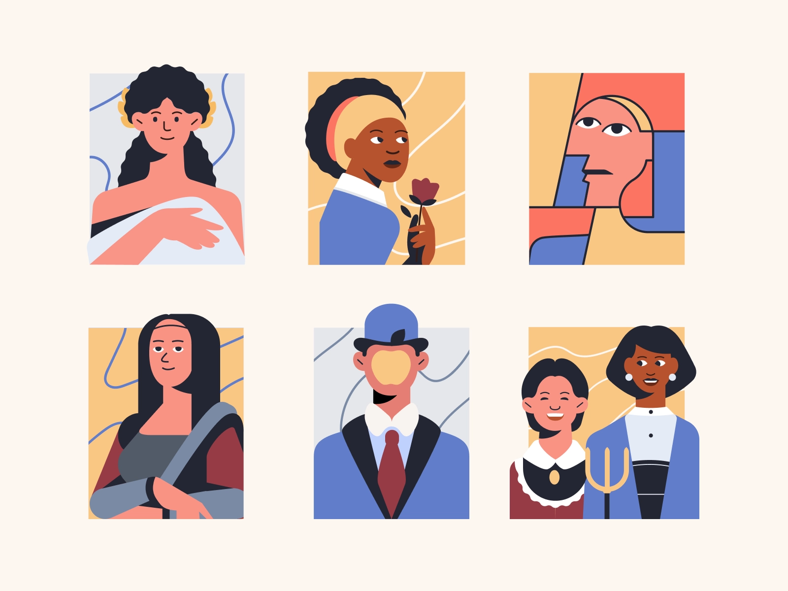

<!-- MIT License>
[![Contributors][contributors-shield]][contributors-url]
[![Forks][forks-shield]][forks-url]
[![Stargazers][stars-shield]][stars-url]
[![Issues][issues-shield]][issues-url]
[![MIT License][license-shield]][license-url]

<!-- PROJECT LOGO -->
<br />
<p align="center">
  <a href="https://github.com/grcasanova/TheSecretPassage">
    
  </a>

  <h3 align="center">TheSecretPassage.</h3>

  <p align="center">
  A simple and decentralised NFT platform built on top of Zilliqa<br />
    <br />
    <a href="https://grcasanova.github.io/TheSecretPassage">View Demo</a>
    ·
    <a href="https://github.com/grcasanova/TheSecretPassage/BUG-TEMPLATE.md">Report Bug</a>
    ·
    <a href="https://github.com/grcasanova/TheSecretPassage/FEATURE-REQUEST.md">Request Feature</a>
  </p>
</p>

<p align="center">
  
</p>

<!-- TABLE OF CONTENTS -->
<details open="open">
  <summary>Table of Contents</summary>
  <ol>
    <li>
      <a href="#about-the-project">About The Project</a>
      <ul>
        <li><a href="#technical-info">Technical Info</a></li>
        <li><a href="#future-ideas">Future Ideas</a></li>
      </ul>
    </li>
    <li>
      <a href="#getting-started">Getting Started</a>
      <ul>
        <li><a href="#prerequisites">Prerequisites</a></li>
        <li><a href="#installation">Installation</a></li>
      </ul>
    </li>
    <li><a href="#usage">Usage</a></li>
    <li><a href="#roadmap">Roadmap</a></li>
    <li><a href="#contributing">Contributing</a></li>
    <li><a href="#license">License</a></li>
    <li><a href="#contact">Contact</a></li>
    <li><a href="#acknowledgements">Acknowledgements</a></li>
  </ol>
</details>


<!-- ABOUT THE PROJECT -->
## About The Project

NFTs are one of the key innovating technologies of the recent years with a massive potential to disrupt the art and multimedia industry. While the technical framework is already there, what is left for mass adoption is to create intuitive systems to make people want to use NFTs. That is the rationale behind *TheSecretPassage*, a NFT showcase gallery with a personal dashboard and an integrated minting platform.
The curated UI is the key enabler for a larger adoption of NFTs in the art world, together with a direct interaction with social media providers and the humanisation of profiles (a nickname and an avatar communicate way more than a wallet address).

Main features
* IPFS-powered metadata
* user accounts with image and nickname
* nfts sorted by category
* modular architecture
* users own their data and can delete it at any times

### Technical Info
On the homepage new users will be presented with a (skippable) registration form where they can set a username and an avatar image that best represents them. The two info will be combined in a JSON and uploaded to IPFS, while the key pair *address* and *metadataCID* will be saved on the smart contract.
By now, all NFTs minted by that user will present the nickname instead of a wallet address.
*TheSecretPassage* users are also shown in a slideshow at the bottom of the homepage, to promote a sense of community.

On the info page users can add a rating to the NFT from 1 to 5 stars and share the artwork on social media, namely *Facebook* and *Reddit*. If the user is the owner of the NFT, they will also be displayed a button to delete (burn) it.

Going to the dashboard, users will have all their NFTs listed and a button to remove their account. Removing their account doesn't delete the NFTs, they will still have to remove them one by one. That is to prevent accidental deletion.

Finally, on the mint page users will be asked to confirm their address as a minter and will be able to mint new NFTs in a codeless way.

### Future Ideas
Surely an integral part of the next development phase will be to further debug the dapp and to include more social integrations like whole portfolio share as well as a bridge for Ethereum-native NFTs.

<!-- GETTING STARTED -->
## Getting Started

Deploy a local copy of the project and test it yourself.

### Prerequisites

To setup the development environment, run the following commands:

* npm
  ```sh
  npm install --global npm@latest
  ```

* yarn
  ```sh
  npm install --global yarn@latest
  ```

You will also need to have some test tokens in your personal wallet and to have installed [ZilPay](https://zilpay.io/) wallet on testnet.

### Installation

To install the repository and run it locally:

1. Clone the repo
   ```sh
   git clone https://github.com/grcasanova/TheSecretPassage.git
   ```
2. Install nodejs packages with *yarn*
   ```sh
   yarn install
   ```
3. Start the app with
   ```sh
   yarn start
   ```

<!-- USAGE EXAMPLES -->
## Usage

Using *TheSecretPassage* is very simple, just head off the [Homepage](https://grcasanova.github.io/TheSecretPassage) and login with your ZilPay wallet, register your username, go to the mint page and confirm your addition to the minters and you're good to go!

<!-- ROADMAP -->
## Roadmap

See the [open issues](https://github.com/grcasanova/TheSecretPassage/issues) for a list of proposed features (and known issues).

<!-- CONTRIBUTING -->
## Contributing

Contributions are what make the open source community such an amazing place to be learn, inspire, and create. Any contributions you make are **greatly appreciated**.

1. Fork the Project
2. Create your Feature Branch (`git checkout -b feature/AmazingFeature`)
3. Commit your Changes (`git commit -m 'Add some AmazingFeature'`)
4. Push to the Branch (`git push origin feature/AmazingFeature`)
5. Open a Pull Request and describe your proposal

<!-- LICENSE -->
## License

Distributed under the MIT License. See `LICENSE` for more information.

<!-- CONTACT -->
## Contact

Web Link: [Homepage](https://grcasanova.github.io/TheSecretPassage)

<!-- AUTHORS -->
## Authors
* [grcasanova](https://github.com/grcasanova)

<!-- ACKNOWLEDGEMENTS -->
## Acknowledgements
* [ReactJs](https://reactjs.org)
* [Zilliqa](https://www.zilliqa.com/)
* [Gitcoin](https://gitcoin.co)
* [Bootstrap](https://getbootstrap.com)

<!-- MARKDOWN LINKS & IMAGES -->
<!-- https://www.markdownguide.org/basic-syntax/#reference-style-links -->
[contributors-shield]: https://img.shields.io/github/contributors/grcasanova/TheSecretPassage.svg?style=for-the-badge
[contributors-url]: https://github.com/grcasanova/TheSecretPassage/graphs/contributors
[forks-shield]: https://img.shields.io/github/forks/grcasanova/TheSecretPassage.svg?style=for-the-badge
[forks-url]: https://github.com/grcasanova/TheSecretPassage/network/members
[stars-shield]: https://img.shields.io/github/stars/grcasanova/TheSecretPassage.svg?style=for-the-badge
[stars-url]: https://github.com/grcasanova/TheSecretPassage/stargazers
[issues-shield]: https://img.shields.io/github/issues/grcasanova/TheSecretPassage.svg?style=for-the-badge
[issues-url]: https://github.com/grcasanova/TheSecretPassage/issues
[license-shield]: https://img.shields.io/github/license/grcasanova/TheSecretPassage.svg?style=for-the-badge
[license-url]: https://github.com/grcasanova/TheSecretPassage/blob/master/LICENSE.txt
[product-screenshot]: images/screenshot.png
